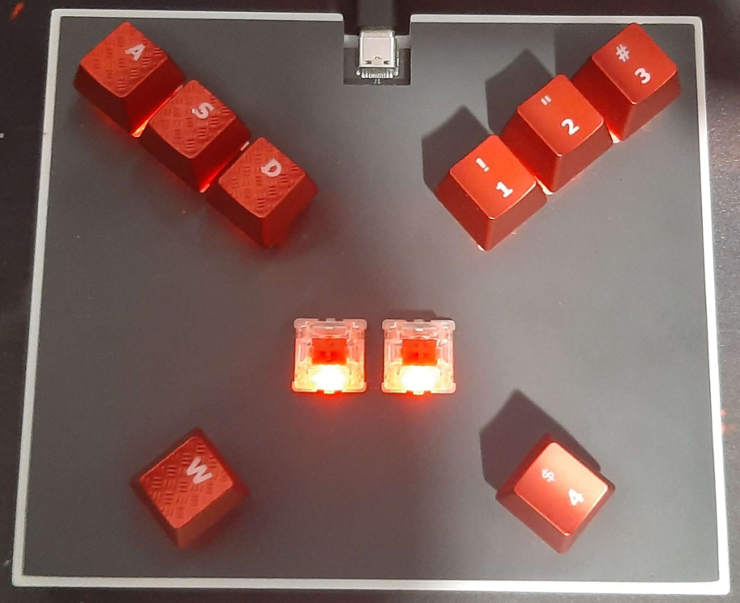
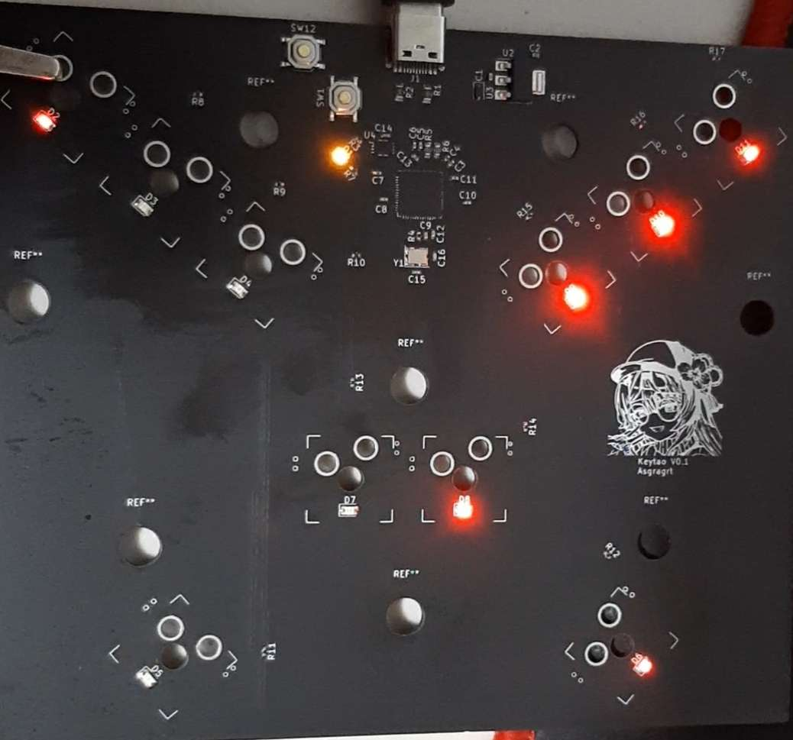

### Hi there 👋

* 🔭 I’m currently working on a windows app for controlling [KeyTao](#keytao) settings through HID in-out.
* 🌱 I’m currently learning C#, Rust, and graphics programming.
* 👯 I’m looking to collaborate on Muse Dash mods or AI projects.
* 💼 I've worked on image (pattern) recognition with tensorflow and keras on python.

![github-stats-overview] ![github-stats-languages]

[github-stats-overview]: https://raw.githubusercontent.com/Asgragrt/github-stats/master/generated/overview.svg#gh-dark-mode-only

[github-stats-languages]: https://raw.githubusercontent.com/Asgragrt/github-stats/master/generated/languages.svg#gh-dark-mode-only

### Skills / Tools

<!-- Add rust

Missing freertos, jupyter, kaggle, keras, solidworks, kicad -->

***

### KeyTao

KeyTao is my main project, involving PCB and case design, as well as firmware coding.
Current features:

* 🕰️ Usage of FreeRTOS kernel.
* ⌨️ N-Key Rollover (NKRO).
* ✨ Store macros per key (up to 4 keys).
* 🔆 6 LED lightning modes.

|             KeyTao              |                   PCB                   |
|:-------------------------------:|:---------------------------------------:|
|  |  |

KeyTao repos

* [KeyTao case](https://github.com/Asgragrt/KeyTao_case)
* [KeyTao schematic](https://github.com/Asgragrt/KeyTao_schematic)
* [KeyTao rust firmware](https://github.com/Asgragrt/KeyTao_firmware)
* [KeyTao C firmware](https://github.com/Asgragrt/firmware_c)
* [**KeyTao C FreeRTOS firmware**](https://github.com/Asgragrt/firmware-rtos) &larr; Current active version

***

### MuseDash Modding

Contributions:

* [MuseDashMirror](https://github.com/MDMods/MuseDashMirror)
* [HiddenQol](https://github.com/MDMods/HiddenQol)
